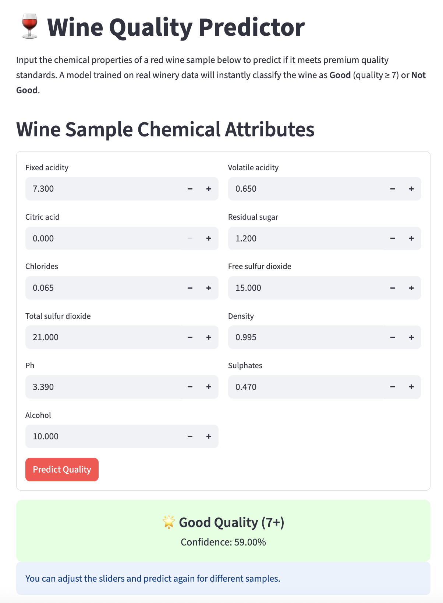

# 🍷 Wine Quality Predictor

A user-friendly web app for predicting if a red wine sample meets premium quality standards, built with Streamlit and machine learning.

---

## 📸 App Screenshot



---

## 🚀 Features

- **Input wine chemical properties** via an interactive form
- **Instantly predicts** if the wine is "Good" (quality ≥ 7) or "Not Good"
- **Confidence score** shown for every prediction
- Powered by a Random Forest model trained on real-world data
- Clean, responsive UI – works on desktop and mobile

---

## 🛠️ How to Run Locally

1. **Clone the repository** and move into the folder:

   ```bash
   git clone https://github.com/hirocenzo/wine-quality-predictor.git
   cd wine-quality-predictor
   ```

2. **(Recommended) Create and activate a virtual environment:**

   ```bash
   python3 -m venv venv
   source venv/bin/activate
   ```

3. **Install requirements:**

   ```bash
   pip install -r requirements.txt
   ```

4. **Ensure the following files are present:**

   - `app.py` (the Streamlit app)
   - `wine_model.pkl` (the trained model)
   - `feature_names.pkl` (list of chemical attributes)

5. **Run the app:**

   ```bash
   streamlit run app.py
   ```

6. Open the provided URL (usually [http://localhost:8501](http://localhost:8501)) in your browser.

---

## 🌐 Online Demo

Try the app live here:  
[https://wine-quality-predictor-mumf5ydcmxjrzauseqptny.streamlit.app/](https://wine-quality-predictor-mumf5ydcmxjrzauseqptny.streamlit.app/)

---

## ⚗️ Chemical Attribute Example for "Good Quality" Wine

Try these values to see a "Good Quality" prediction:

| Feature              | Value |
| -------------------- | ----- |
| fixed acidity        | 7.3   |
| volatile acidity     | 0.65  |
| citric acid          | 0.00  |
| residual sugar       | 1.2   |
| chlorides            | 0.065 |
| free sulfur dioxide  | 15.0  |
| total sulfur dioxide | 21.0  |
| density              | 0.995 |
| pH                   | 3.39  |
| sulphates            | 0.47  |
| alcohol              | 10.0  |

---

## 🙏 Credits

- Dataset: [UCI Machine Learning Repository – Wine Quality](https://archive.ics.uci.edu/ml/datasets/wine+quality)
- App by Paul Tristan Dujali for a boutique winery QA project

---

## 📄 License

This project is for educational and demonstration purposes.

---
```
